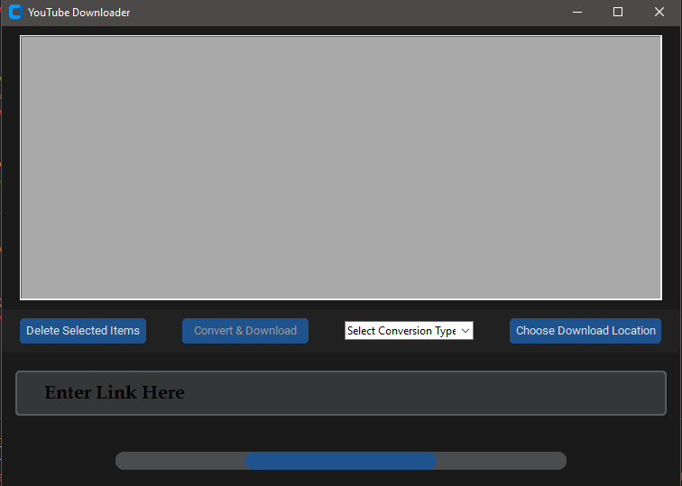
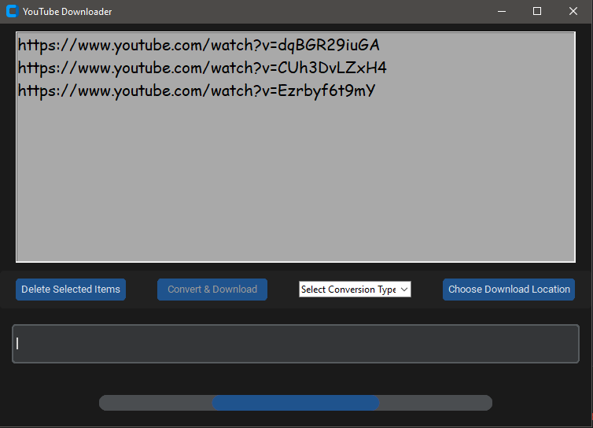
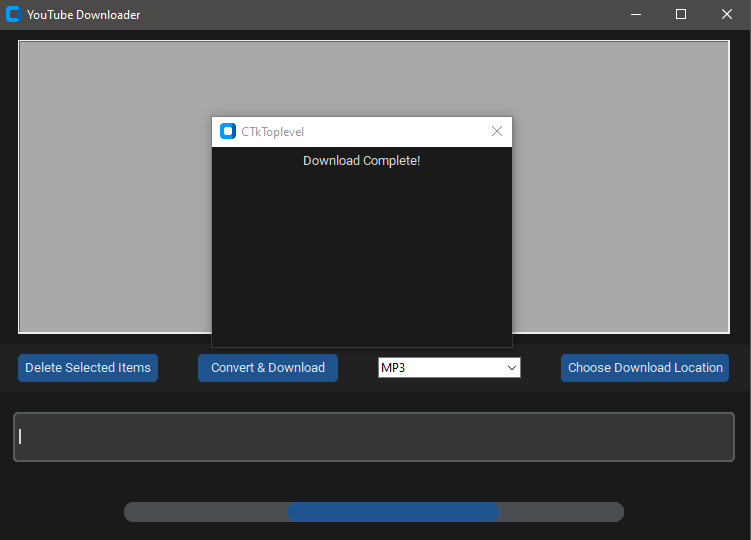

 # Youtube MP3/MP4 Converter made in Python
I decided to make a YouTube video converter mainly to help me setup custom song radios in games. It is free to use just download the repository by clicking <b>Code -> Download ZIP</b> 

 ## Libraries used:
    - PyTube for downloading and converting the youtube video
    - moviepy for converting the MP4 file to MP3 on the disk
    - validators to validate if a URL is legit or not
    - os for removing, renaming files/directories
    - tkinter and customtkinter for the GUI

## Instructions:
#### 1. Make sure you have python installed! Install all the needed packages by running these commands one by one in a command prompt/terminal:
    pip install PyTube
    pip install moviepy
    pip install validators
    pip install customtkinter
    pip install tkinter

#### 2. Open your command prompt/terminal and navigate to the folder where the current folder where the scripts are. Now run this command:
    python main.py
##### - If "python" is not recognized try doing "python3 main.py" if you have installed python 3+

#### The app window should open and look like this:

#### 3. In the text box on the bottom you can insert any YouTube video link and click the 'Enter' button on your keyboard to insert it in the list and then it will appear on the top. Looks like this:

#### 4. In this list you can select one or more links and remove them from the list by either clicking the "Delete Selected Items" button in the window or the Delete or Backspace button on your keyboard.
Afterwards you have to choose the conversion type to either MP3 or MP4 from the dropdown menu saying "Select Conversion Type" and also the download location where the files will be stored by clicking "Choose Download Location".
#### 5. After those two are selected the "Convert & Download" button should enable itself and once you click it the program will start working on the videos you've added. If the "Convert & Download" button is still disabled/greyed out then make sure you have fulfilled these requirements:
    - You have inserted at least one link and it is visible in the list
    - You have selected the conversion type to either MP3 or MP4
    - You have chose a download location
 
 #### 6. Once the download is complete it should show a pop-up window like this:
 

 #### If There is an issue with one or more of the links you will see this screen:
 

 
## Disclaimer: if the window is starting but the converting is not working at all, make sure all python packages are up to date!